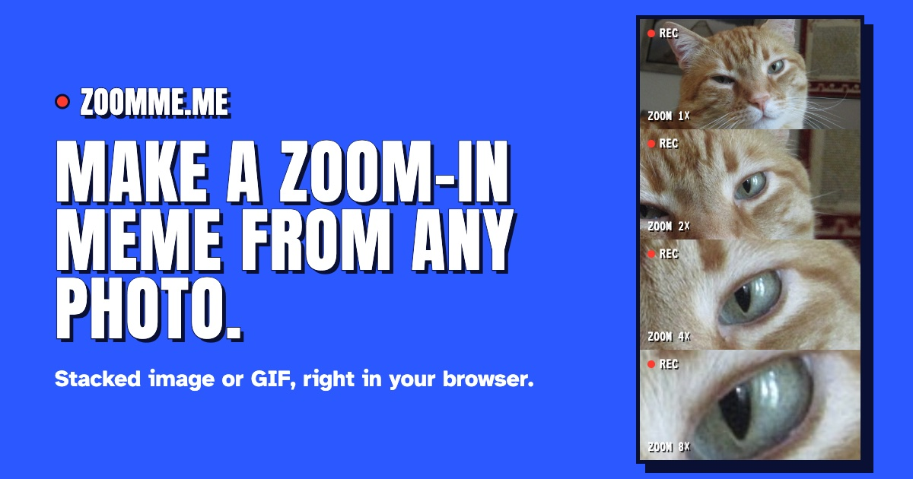

# ZoomME.ME 👀

> [zoomme.me](https://zoomme.me): make a zoom-in meme from any photo.



Click the spot to zoom into, choose how far to go, and get a stacked image or a GIF that closes in on it. Everything runs in the browser: your photo never leaves your device.

## Features

- Load a photo by picking it, dropping it anywhere on the page, or pasting it (JPEG, PNG, GIF, WebP)
- Set the focus point by clicking, or nudge it with the arrow keys
- Zoom from 2× to 16×, over 3, 4 or 5 frames, and fine-tune each frame
- Export as a stacked image or an animated GIF, at three speeds
- Optional camcorder overlay and zoomme.me credit
- Download, copy or share the result

## Development

```bash
npm install     # install dependencies
npm start       # dev server
npm run build   # production build to dist/
npm test        # unit tests
npm run lint    # lint and format check
```

## Under the hood

- Vanilla JS, no framework
- GIF encoding with [gifenc](https://github.com/mattdesl/gifenc)
- Bundling and dev server via [Vite](https://vite.dev)
- Linting and formatting via [Biome](https://biomejs.dev)
- Unit tests with [Vitest](https://vitest.dev)

## Credits

Inspired by [Gianluca Mezzo](https://twitter.com/GianlucaMezzo). The landing demo photos are CC0 or public domain, from [Wikimedia Commons](https://commons.wikimedia.org); sources are listed in [`demoPhotos.js`](src/js/modules/demoPhotos.js).
